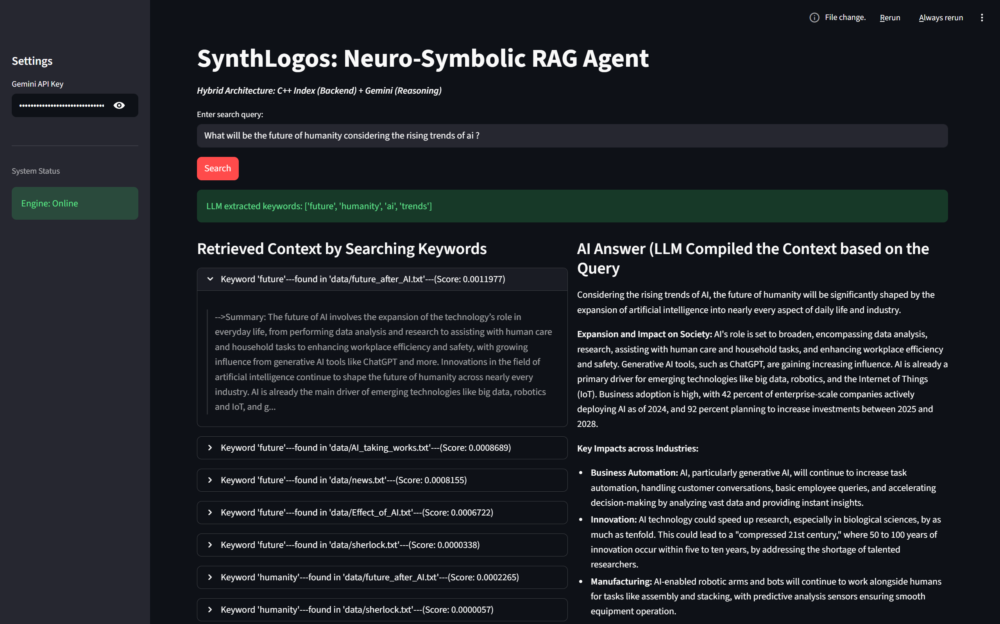
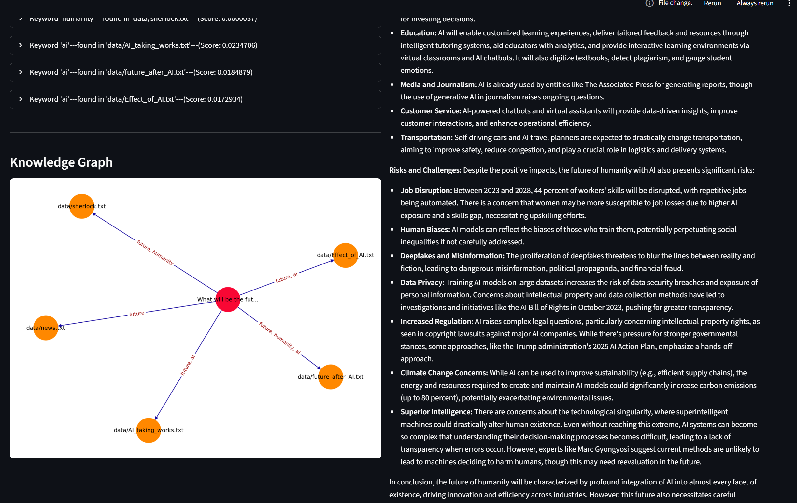
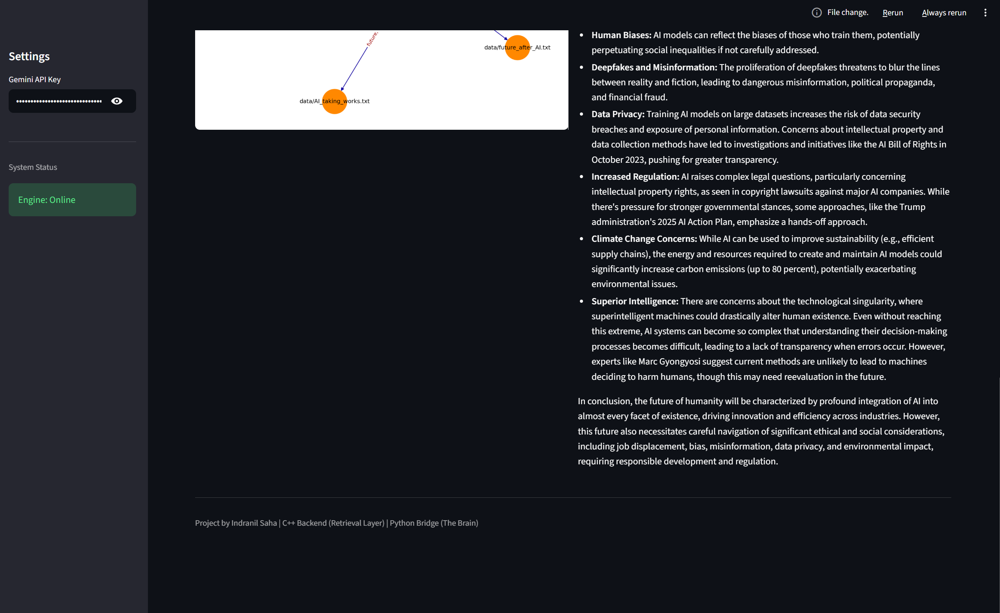

# SynthLogos: Neuro-Symbolic RAG Agent


> **A Neuro-Symbolic RAG Agent that utilize Generative AI using a deterministic C++ retrieval layer.**

## 💡 The "Why"
In an era of "Vector Databases" and "LangChain wrappers," I wanted to understand the fundamentals of information retrieval. **SynthLogos** is not a search engine; it is an Autonomous Retrieval System.

I built the core retrieval logic from scratch in **C++** to handle high-performance indexing, while using **Python** and **Google Gemini** as the "cognitive" layer to understand user intent and synthesize answers.

##  Architecture: Neuro-Symbolic Design
The system follows a "Brain & Muscle" pattern:

1.  **The Brain (Neuro):** Python + Gemini.
    * The user asks a complex question.
    * The LLM analyzes the intent and extracts specific *search keywords* (e.g. Query : "Who built Linux ?" --> "Linux", "build" ).
2.  **The Muscle (Symbolic):** Custom C++ Engine.
    * Receives keywords and executes an $O(N)$ lookup against the Inverted Index.
    * Extracts context using the KMP Algorithm.
    * Ranks results using TF-IDF.
3.  **The Synthesis:**
    * The gathered evidence is fed back to the LLM to generate a fact-based answer, eliminating hallucinations.

## 🖥️ The Interface: Observability Dashboard
**SynthLogos Dashboard** (built with Streamlit) is designed for transparency. It serves as a real-time monitor for the Neuro-Symbolic loop:

* **Logic Tracing:** Visualize the exact keywords the **AI Agent** extracts to control the C++ backend.
* **Raw Evidence Inspection:** View the raw, un-hallucinated text snippets retrieved by the engine *before* they are synthesized, allowing for manual fact-checking.
* **Knowledge Graph:** A dynamic **NetworkX** visualization that maps the semantic distance (Higher TF*IDF score = smaller edge length ) between user queries and retrieved documents with keywords labeled edges, showing the hidden relationships in the data.

## Technical Deep Dive (The C++ Backend)
*This backend is an evolution of my standalone **[Search Engine Project](https://github.com/MutantCoder123/Efficient-Search-Engine.git)**, adapted here with a "Headless Mode with autonomous data loader" for real-time Python integration.*

The binary (`engine.exe`) is optimized for speed and memory efficiency, featuring:

* **Custom Data Structures:**
    * **Trie (Prefix Tree):** For rapid dictionary lookups and prefix matching.
    * **Inverted Index:** Maps keywords to specific document IDs for instant retrieval.
* **Algorithms:**
    * **KMP (Knuth-Morris-Pratt):** Implemented for $O(N)$ pattern matching to find and extract text snippets without backtracking.
    * **TF-IDF Ranking:** Scores documents based on Term Frequency-Inverse Document Frequency.
* **Systems Programming:**
    * **Arena Allocation:** Custom memory allocator to minimize heap fragmentation.
    * **Headless I/O:** Unlike the standalone version, this engine strips all UI/menus and communicates strictly via standard input/output (STDIN/STDOUT), acting as a data retriever for the Python frontend.


### Key Improvements
I recently pushed several major optimizations.
* **Fixed Context Gaps:** Previously, if a file was found by one keyword, it was ignored for others. I fixed the bridge logic so it now captures *all* relevant contexts for every keyword, merging the data properly.
* **Enhanced Scraper:** Increased the context window size and snippet count. The engine now scrapes full details rather than just tiny fragments.
* **Smart Prompting:** Improved the LLM system prompt to handle keyword extraction more efficiently and generate stricter, fact-based responses.
* **Visualization:** In the *Knowledge Graph* now the edges are labeled with *Keywords* to show how the query relates to the document.

## 📂 Project Structure
```text
├── backend/
│   ├── engine.cpp       # Main entry point (Indexing & Search Loop)
│   ├── engine.exe       # Compiled binary
│   ├── arena.h          # Custom memory allocator
│   ├── trie.h           # Trie data structure implementation
│   ├── kmp.h            # KMP algorithm for pattern matching
│   └── data/            # Knowledge base (Text corpus)
├── modules/
│   ├── bridge.py        # Python-C++ Interop (Subprocess Pipes)
│   ├── llm.py           # Gemini Wrapper (RAG Logic)
│   └── graph.py         # NetworkX Visualization Logic
├── tools/
│   └── dataset_gen.py   # Script to fetch random/useful facts
├── screenshots/         # Images for documentation 
for testing
├── app.py               # Main Streamlit Dashboard
└── .env                 # API Credentials (Ignored by Git)
```
## Demo & Output

Here are the screenshots of **SynthLogos** running on **streamlit**






# Setup & Run Guide

## 1. Prerequisites
Before you begin, ensure you have the following installed:
* **C++ Compiler:** `g++` (MinGW for Windows, GCC for Linux/Mac).
* **Python:** Version 3.8 or higher.
* **Google Gemini API Key:** Get one from [Google AI Studio](https://aistudio.google.com/).

---

## 2. Project Structure
 Your folder hierarchy must look exactly like this for the Python bridge to communicate with the C++ engine.

```text
SynthLogos/
├── .env                  # File to store GEMINI_API_KEY
├── app.py                # Main Streamlit Application
├── requirements.txt      # Python dependencies
├── modules/
│   ├── bridge.py         # Handles Python <-> C++ communication
│   ├── graph.py          # NetworkX Graph Visualization
│   └── llm.py            # Gemini AI Logic
└── backend/              # C++ Engine Directory
    ├── engine.cpp        # Main Search Engine Source Code
    ├── arena.h           # Custom Memory Arena
    ├── trie.h            # Trie Data Structure
    ├── kmp.h             # KMP Pattern Matching Algo
    └── data/             # DATA FOLDER (Put .txt files here)
        ├── draft1.txt
        ├── draft2.txt
        └── ...
```

---

## 3. Installation Steps

### Step 1: Install Python Libraries
Open your terminal in the root `SynthLogos` folder and run:
```bash
pip install streamlit networkx matplotlib google-generativeai python-dotenv
```

### Step 2: Compile the C++ Engine
The Python app needs the compiled executable to run searches.

1. Navigate into the `backend` folder:
   ```bash
   cd backend
   ```

2. Compile the engine:
   * **Windows:**
     ```bash
     g++ engine.cpp -o engine
     ```
   * **Mac / Linux:**
     ```bash
     g++ engine.cpp -o engine
     ```

3. **Verify:** Check that a file named `engine.exe` (Windows) or `engine` (Mac/Linux) has been created inside the `backend/` folder.

4. Return to the root folder:
   ```bash
   cd ..
   ```

### Step 3: Setup Data
* Go to `backend/data/`.
* Add your `.txt` files there.

### Step 4: Configure API Key
1. Create a file named `.env` in the root `SynthLogos/` folder.
2. Add your API key inside it:
   ```ini
   GEMINI_API_KEY=your_actual_api_key_here
   ```

---

## 4. How to Run
Once everything is set up, run the application from the **root** folder:

```bash
streamlit run app.py
```

This will automatically open your default web browser to `http://localhost:8501`.

---

## 5. Troubleshooting

| Error Message | Cause | Solution |
| :--- | :--- | :--- |
| **"Engine NOT found at..."** | The `engine.exe` file is missing. | Run `g++ engine.cpp -o engine` inside the `backend/` folder. |
| **"[WinError 2] The system cannot find the file specified"** | Python cannot see the backend folder. | Ensure you are running `streamlit run app.py` from the root `SynthLogos` folder, not inside `backend`. |
